# admin-stock

  

Stock-management desktop app for an electronics company.

Built with Python, Qt and SQLite. First ever project!

    
    &nbsp;&nbsp;&nbsp;&nbsp;
    
    &nbsp;&nbsp;&nbsp;&nbsp;
    

## Overview

Desktop app for managing a company's stock of electronic components—stored at local and remote sites—through incoming and outgoing operations based on production reports. It relies on a lightweight database, uses modular components and offers various logging and configuration options.

    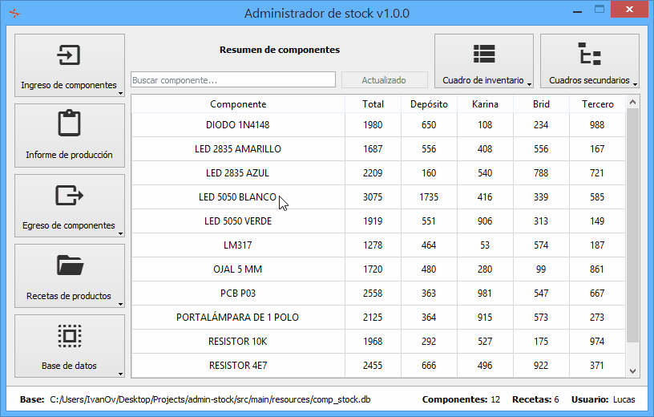

Features:

- Basic CRUD ops for components and product recipes
- Stock calculation for incoming and outgoing ops
- Logs for components, movements and configs
- Storage in SQL and system registry settings
- Reports exported as Excel spreadsheets
- Autocompletion, coloring, filtering

## Installation

1. Install [Python 3.7](https://www.python.org/downloads/)
2. Get package manager: `pip install pipenv`
3. Clone repo and get dependencies: `pipenv install`
4. Run: `pipenv run fbs run`

## Operation

The app displays a main table with all components and their four stock levels: total, local at `Depósito` and three remotes at assemblers. Secondary tables for logs are available at `Cuadros secundarios`. Data is read from a db at `src/main/resources/comp_stock.db` and is summarized inside the status bar at the bottom.

    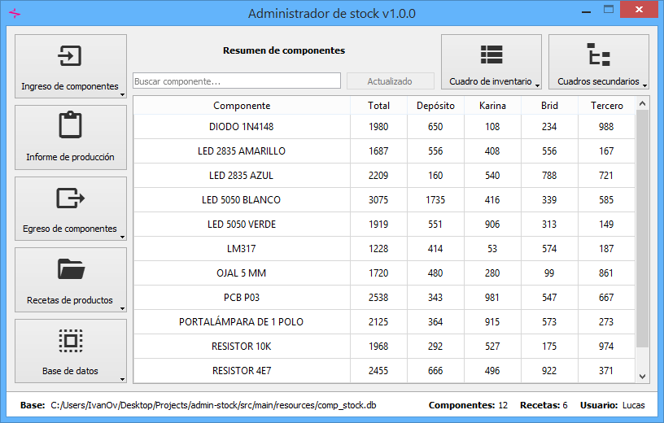

### Adding components to local stock

Press `Ingreso de componentes` and select `Ingreso a Depósito`. Enter the packing list number in `Remito`, the supplier name in `Proveedor` and an optional note in `Nota`. Enter component names and incoming amounts and press `Ejecutar`.

    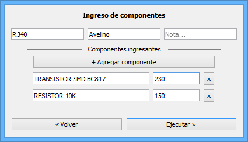

### Issuing a production report

A **production report** is an Excel spreadsheet containing the products to be manufactured, the components needed, the components to be sent to the assembler considering their stock, and the number of components actually sent.

Press `Informe de producción`. Enter an identification code in `Código` (prefixed by the letter `K`, `B` or `T` based on the assembler's initial). Enter product names and production amounts. Press `Calcular` to preview the needed components and their total amounts. Press `Ejecutar` to issue a production report as an Excel spreadsheet into the `output` directory.

    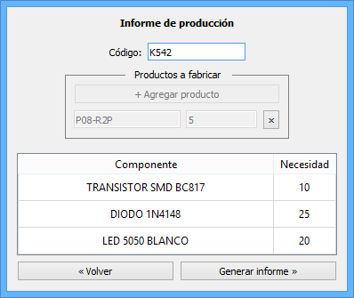

### Moving stock from local to assembler

**Important**: The final column of the production report needs to be filled in by an employee before executing this operation.

Press `Egreso de componentes` and select `Egreso a armador`. Press `Seleccionar informe...` to select a production report (`INFORME DE PRODUCCIÓN`) from the `output` directory. Press `Ejecutar`.

For each component listed in the report, the outgoing amount is subtracted from local stock and added to assembler's stock (according to the report prefix). Finally, the amounts needed for production are subtracted from the assembler's stock.

    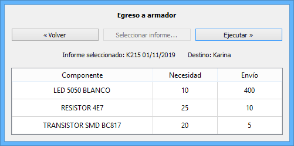

### Moving stock from local to internal use

Press `Egreso de componentes` and then `Egreso interno`. Enter component names and outgoing amounts and press `Ejecutar`.

For the listed components, the outgoing amounts will be subtracted from local stock. Use this function for taking components out of stock for making experimental prototypes or samples for trade shows.

    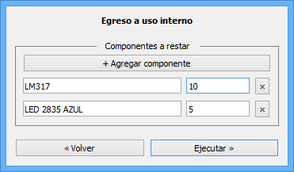

### Creating, editing and deleting a component

To create a component, Press `Ingreso de componentes` and select `Crear componente`. Enter the component name and an optional initial amount and press `Ejecutar`.

To edit a component, Press `Ingreso de componentes` and select `Editar componente`. Search for, or double Press, a component. Enter a new name for the component and press `Ejecutar`.

To delete a component, Press `Ingreso de componentes` and select `Borrar componente`. Search for a component and press `Ejecutar`.

    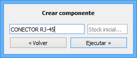
    &nbsp;&nbsp;&nbsp;&nbsp;
    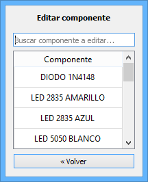
    &nbsp;&nbsp;&nbsp;&nbsp;

### Viewing component details

To view all the details logged for a component, double click on a component name in the main table. Press `Exportar detalles` to export them as an Excel spreadsheet into the `output` directory.

    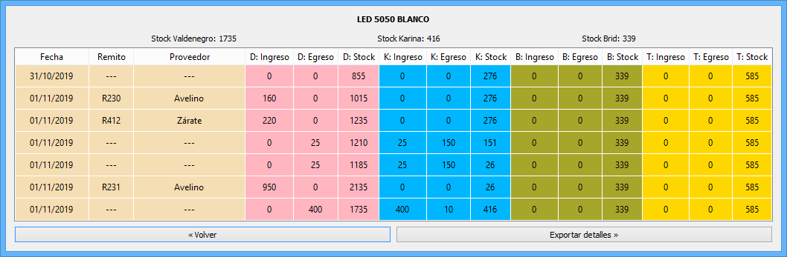

### Creating, editing and deleting a recipe

A **recipe** is a collection of components that make up a product.

To create a recipe, Press `Recetas de productos` and select `Crear receta`. Enter the component name and an optional initial amount and press `Ejecutar`.

To edit a recipe, Press `Recetas de productos` and select `Editar receta`. Search for, or double Press, a component. Enter a new name for the component and press `Ejecutar`.

To delete a recipe, Press `Recetas de productos` and select `Borrar receta`. Search for a component and press `Ejecutar`.

    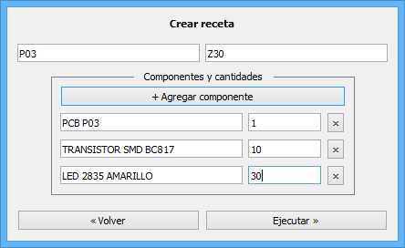
    &nbsp;&nbsp;&nbsp;&nbsp;
    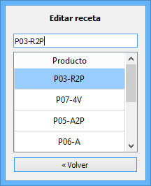

## Configuration

### Coloring critical components

**Critical components** are those with total stock below a critical amount set by the user.

Press `Cuadro de inventario` and select `Resaltar críticos`. Press `Agregar` to add component names and amounts and press `Guardar` to save. Critical components will be colored orange in the main table.

    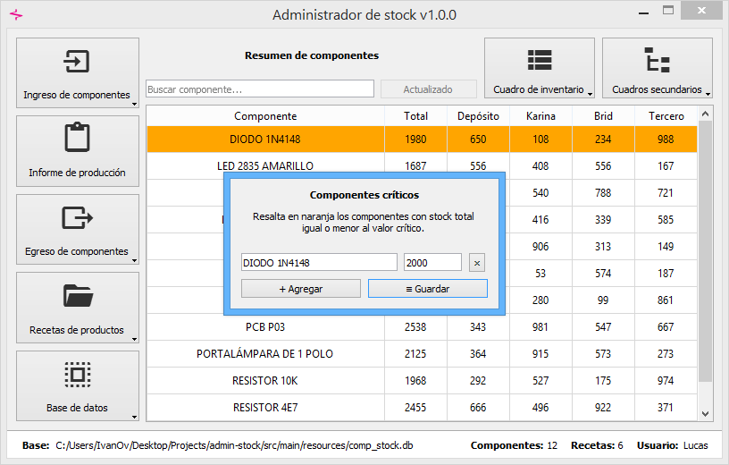

### Coloring excluded components

**Excluded components** are those not included in any product recipe.

Press `Cuadro de inventario` and select `Componentes excluidos`. To have them colored in yellow in the main table, tick the checkbox `Resaltar excluidos en amarillo`.

    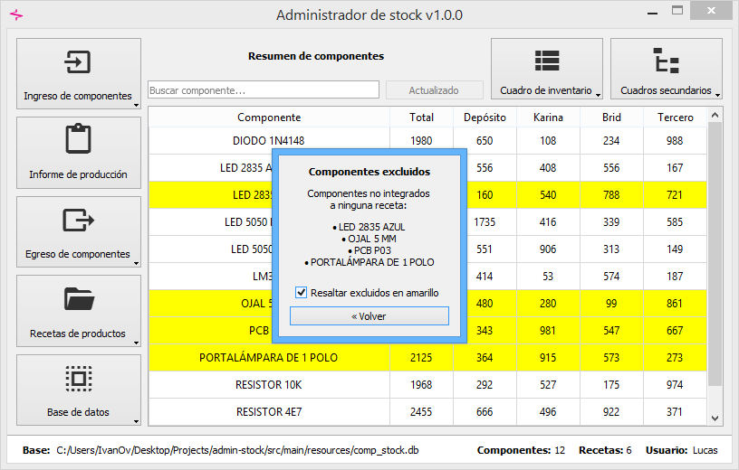

### Exporting the main table

Press `Cuadro de inventario` and select `Exportar datos` to export the main table as an Excel spreadsheet into the `output` directory.

    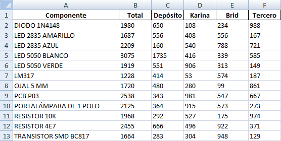

### Viewing movement logs

Press `Cuadros secundarios` and select `Movimientos`. Filter by time period, movement (incoming or outgoing operation), component name, destination and username. Press `Borrar historial` to delete the records. Press `Exportar historial` to export the records as an Excel spreadsheet into the `output` directory.

    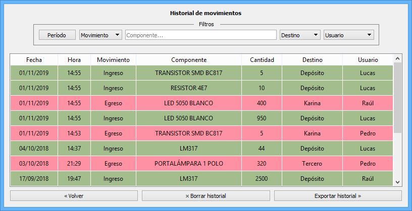

### Viewing configuration logs

Press `Cuadros secundarios` and select `Configuraciones`. Filter by time period, movement (incoming or outgoing operation), component name, destination and username. Press `Borrar historial` to delete the records. Press `Exportar historial` to export the records as an Excel spreadsheet into the `output` directory.

    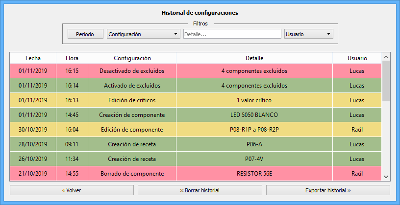

### Selecting a database

Press `Base de datos` and select `Cambiar base`. Press `Examinar...` to select a new database and finally `Guardar`.

If the path to the location becomes broken because the database is moved from the directory or deleted, the user will be prompted to select a new location.

    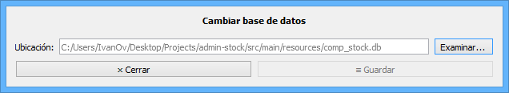

### Backup and user renaming

Press `Base de datos`, select `Respaldar base` and confirm. The backup database will be named like the original database plus the backup execution date and time.

Press `Base de datos`, select `Editar usuario` and enter a new name for the user. This username will be reflected in the status bar and in the secondary tables `Movimientos` and `Configuraciones`.

    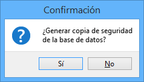
    &nbsp;&nbsp;&nbsp;&nbsp;
    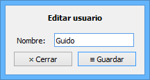

### Shortcuts

| Keys            | Action                                                  |
| --------------- | ------------------------------------------------------- |
| `Alt+1`         | `Ingreso de componentes` toolbutton on left-hand column |
| `Alt+2`         | `Informe de producción` toolbutton on left-hand column  |
| `Alt+3`         | `Egreso de componentes` toolbutton on left-hand column  |
| `Alt+4`         | `Recetas de productos` toolbutton on left-hand column   |
| `Alt+5`         | `Base de datos` toolbutton on left-hand column          |
| `Alt+[initial]` | Action button in modal dialog, based on initial         |
| `Alt+x`         | Export action button in modal dialog                    |

## Author

© 2019 Iván Ovejero

## License

Distributed under the MIT License. See [LICENSE.md](LICENSE.md)
